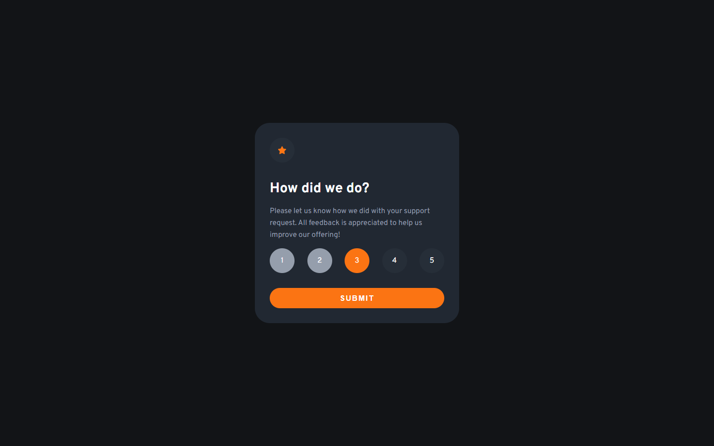

# Frontend Mentor - Interactive rating component solution

This is a solution to the [Interactive rating component challenge on Frontend Mentor](https://www.frontendmentor.io/challenges/interactive-rating-component-koxpeBUmI). Frontend Mentor challenges help you improve your coding skills by building realistic projects.

## Table of contents

- [Overview](#overview)
  - [The challenge](#the-challenge)
  - [Screenshot](#screenshot)
  - [Links](#links)
- [My process](#my-process)
  - [Built with](#built-with)
  - [What I learned](#what-i-learned)
- [Author](#author)

**Note: Delete this note and update the table of contents based on what sections you keep.**

## Overview

### The challenge

Users should be able to:

- View the optimal layout for the app depending on their device's screen size
- See hover states for all interactive elements on the page
- Select and submit a number rating
- See the "Thank you" card state after submitting a rating
- What the User Select all the before number are colored

### Screenshot



### Links

- Solution URL: [https://github.com/abdelrhmanKh/interactive-rating-component-main](https://github.com/abdelrhmanKh/interactive-rating-component-mainm)
- Live Site URL: [https://abdelrhmankh.github.io/interactive-rating-component-main/](https://abdelrhmankh.github.io/interactive-rating-component-main/)

## My process

### Built with

- Semantic HTML5 markup
- CSS custom properties
- absoulte Postions
- Mobile-first workflow

### What I learned

This is A better way to loop over ratting li to see which one the mouse is on

```js
for (const li of ratting) {
  console.log(li);
}
```

This is the old way

```js
for (let i = 0; i <= ratting.length - 1; i++) {
  console.log(ratting[i]);
}
```

## Author

- Website - [AbdelRahman Khalil](https://abdelrhmankh.github.io/abdelrhmankhalil/)
- Frontend Mentor - [@abdelrhmanKh](https://www.frontendmentor.io/profile/abdelrhmanKh)
- LinkedIn - [@Abdelrhman-khalil](https://www.linkedin.com/in/abdelrhman-khalil-ali-9716a0188/)
